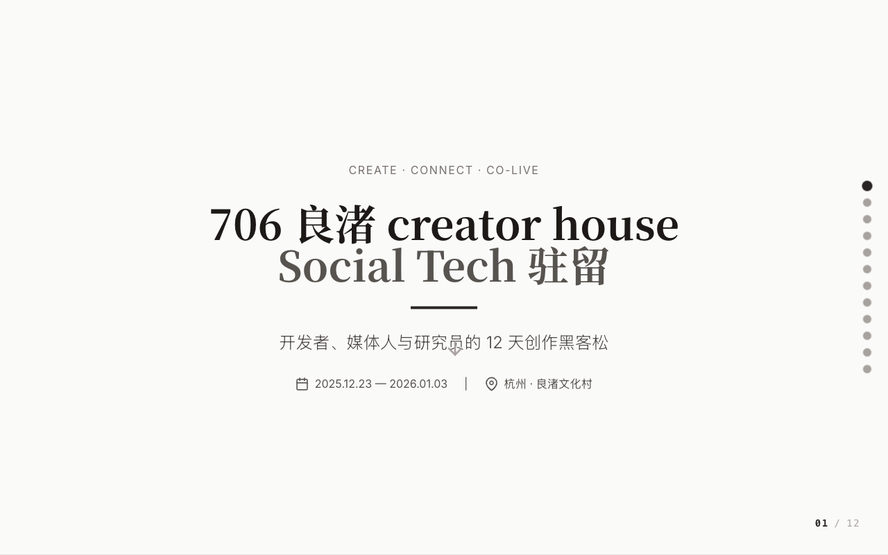

# 706 良渚 Creator House · Social Tech 驻留

**开发者、媒体人与研究员的 12 天创作黑客松。**
CREATE · CONNECT · CO-LIVE

**2025.12.23 — 2026.01.03（跨年）** · 杭州 · 良渚文化村

**🔗 在线预览：<https://wang-xiaochuan.github.io/706/>**

---

## 核心设计：三松合一

传统 Hacker House 是开发者的乐园，但**往往局限于技术本身**。这个项目的假设是：当开发者、媒体人和社科生在同一时间、同一地点共同面对一个快速变化的世界时，**单一学科已经不足以理解正在发生的变化**。

所以这里不是平行的赛道，而是同一件事的三个切面——**理解、表达与介入**：

| 松 | 英文 | 做什么 | 产出取向 |
|----|------|--------|---------|
| **研究松** | RESEARCH HACKATHON | 以社会科学视角观察技术与社会的互动 | 探讨算法、劳动与身份再定义；建立理解时代机制的新框架；输出接地气、有深度的洞察 |
| **媒体松** | MEDIA HACKATHON | 关注叙事与传播的重构，尝试新的内容形式 | 探索算法洪流中的有效传播；找到更打动人的话题；创造新型媒介语言 |
| **产品松** | PRODUCT HACKATHON | 以编程与系统思维为工具，探索协作边界 | 做 AI 与人类协作的小型工具；解决具体微小的互动痛点 |

**本期核心主题：社会技术（Social Tech）**——一套介于制度分析与日常实践之间的中观方法。围绕四个维度展开：

`技术` 工具与系统 · `连接` 共居与共创 · `叙事` 表达与传播 · `洞察` 社会与结构

对三类参与者各有一个分析视角：

- **对开发者** —— 技术系统如何嵌入社会互动、影响情绪调节与行为决策
- **对媒体人** —— 叙事结构、媒介选择与算法推荐之间的共构关系
- **对社科研究者** —— 检视「技术—主体—结构」三者循环的操作性框架

## 12 天议程

**2025.12.23 — 2026.01.03（跨年）**

| 时间 | 阶段 | 内容 |
|------|------|------|
| D1–D3 | **启动与观察** | 抵达、破冰、园区参访、社会田野 |
| D4–D6 | **输入与发酵** | 嘉宾分享、自由创作、夜游 |
| D7–D9 | **深潜冲刺** | 全天作品冲刺（Hackathon Mode On） |
| D10 | **跨年 Demo Night** | 跨年派对（邀约 ~80 人）、成果展示 |
| D11–D12 | **沉淀与告别** | 成果复盘、话题交流、团建送别 |

**Grand Finale：Demo Day × 跨年派对**
驻留期间的 Social Tech 产出以展览形式布置在跨年派对现场。这不只是展示，更是一场"强社交、强链接"的集体实验，对抗技术异化。

> 利用跨年这个"时间的断点"，重新整理未被说清的感受。

## 共居设计

共居**不是为了营造亲密感**，而是让误会、信任、节奏在日常流中自然显露。这种现场经验是 Social Tech 的基础。

- **居住**：706 良渚生活实验室
- **工作**：良渚玉鸟集

**为什么是良渚**：这里介于城市与乡村之间。生活密度低，空间尺度适合步行。在"可呼吸的节奏"里，让创作从发呆、散步和吃饭中生长出来。

## 期待什么样的产出

三个方向各有一个具体示例（页面上可直接试玩）：

| 产出 | 痛点 | 形式 | 效果 |
|------|------|------|------|
| **偏见觉察工具** | "我常常误解别人" | 偏见自检清单 / 提示卡 | 降低无意识偏见，从源头减少误解 |
| **深度对话提示器** | "聊天聊不深，停在表面" | 结构化对话动作表 | 突破表层沟通，形成真实交流 |
| **社交连接小卡片** | "不知如何开启深度对话" | 可视化问题库 | 降低社交陌生感，建立情感连接 |

## 页面里的两个交互 Demo

落地页不只是活动介绍，本身也放了两个 Social Tech 的构想原型：

| Demo | 做什么 |
|------|--------|
| **AI 灵感生成器** | 输入你的角色（程序员 / 媒体人 / 社科研究员 / 人类观察家）和关心的议题，生成融合**研究视角 + 媒体叙事 + 产品原型**三维度的方案 |
| **偏见觉察工具** | 输入一句你在沟通中容易脱口而出的话，AI 分析其中隐含的情绪偏见与暴力沟通成分，并给出更温和的改写建议 |

这两个 Demo 体现了活动的方法论：**用技术手段处理技术带来的社会问题**。

## 招募与组织

**招募 12–16 位驻留者 · 深度共居。** 活动免费，仅需带着真诚与开放的心。

欢迎"不太符合预期的组合"：会写代码但做视觉采样的开发者；研究亲密关系但也调试模型的社科生……

> 我们希望远离典型的 "Techno-bro" 气质。如果你是女性、非二元伙伴，或在技术文化中长期被忽略的创作者，这里是你的主场。

**组织机构**

| 角色 | 机构 |
|------|------|
| 主办方 | **706 青年空间**（良渚 Social Tech Lab）—— 致力于探索生活可能性、促进青年人连接与公共生活的自治社区 |
| 核心社群伙伴 | **Way to AGI** —— 中国最大 AI 爱好者社群 |
| 场地支持伙伴 | **跳海酒馆** —— 跨年派对共创空间 |

（报名已于 2025.11.30 截止，活动于 2026.01.03 结束。）

## 技术说明

**单文件 HTML，自包含，无构建步骤。**

- 12 页滚动式 deck，右侧圆点导航，时间轴支持鼠标悬停查看详情
- 样式与脚本内联，React 与 Tailwind 走 CDN
- 交互 Demo 依赖 Gemini API（需配置 API key 才能实际调用）
- Pages 部署：Settings → Pages → `main` 分支 `/ (root)`
